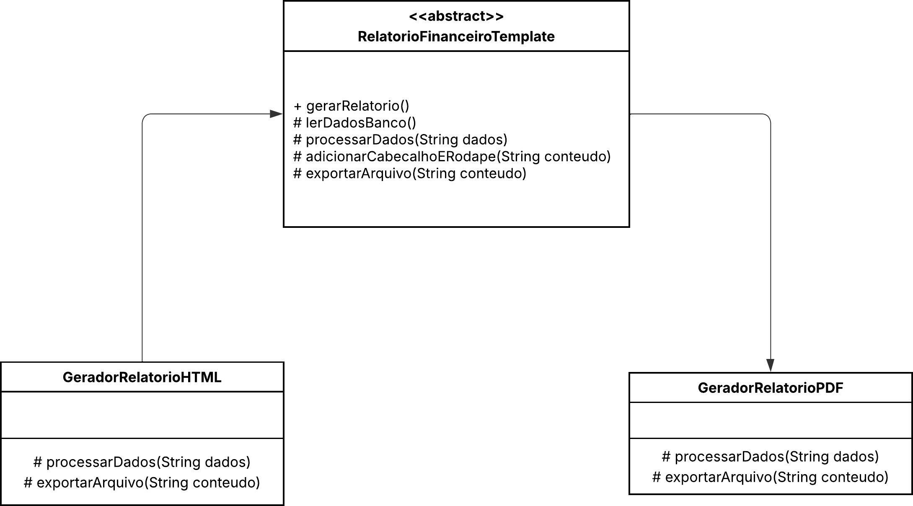
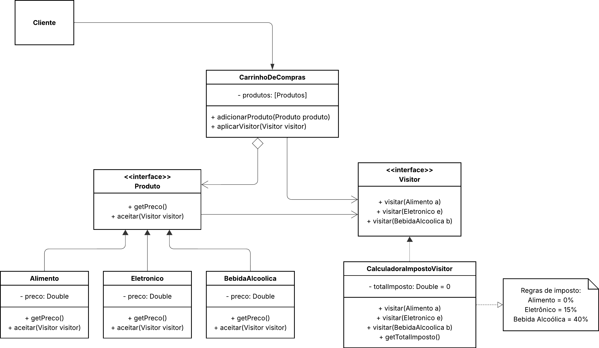

# Padrões de Projeto - Implementação 05

## Dupla
- **Marcos Vinicius Nascimento Souza**
- **Diego Cordeiro Pedrosa**


## Padrões Trabalhados

Este projeto implementa dois padrões comportamentais do GoF (Gang of Four):

1. **Template Method**
2. **Visitor**


## Estrutura de Arquivos

```
implementacao-05/
├── template-method-pps/
│   ├── pom.xml
│   └── src/main/java/com/pps/templatemethod/
│       ├── RelatorioFinanceiroTemplate.java
│       ├── GeradorRelatorioPDF.java
│       ├── GeradorRelatorioHTML.java
│       └── Main.java
├── visitor-pps/
│   ├── pom.xml
│   └── src/main/java/com/pps/visitor/
│       ├── Produto.java
│       ├── Alimento.java
│       ├── Eletronico.java
│       ├── BebidaAlcoolica.java
│       ├── Visitor.java
│       ├── CalculadoraImpostoVisitor.java
│       ├── CarrinhoDeCompras.java
│       └── Main.java
└── assets/
    ├── template-method-diagrama.png
    └── visitor-diagrama.png
```

---

## 1. Template Method - Processamento de Relatórios Financeiros

### Problema
Múltiplas classes de geração de relatórios duplicam código no fluxo comum: leitura de dados, adição de cabeçalho/rodapé e exportação. Alterações no cabeçalho exigem mudanças em todas as classes.

### Solução
O padrão **Template Method** define o algoritmo na classe abstrata `RelatorioFinanceiroTemplate`, permitindo que subclasses (`GeradorRelatorioPDF` e `GeradorRelatorioHTML`) sobrescrevam apenas as etapas específicas de formatação e exportação, eliminando duplicação.

### Diagrama de Classes


---

## 2. Visitor - Auditoria e Tributação

### Problema
Adicionar operações (cálculo de imposto, frete, etiquetas) diretamente nas classes de produto viola o Princípio da Responsabilidade Única e causa inchamento de código.

### Solução
O padrão **Visitor** extrai a lógica de cálculo de impostos para a classe `CalculadoraImpostoVisitor`, mantendo as classes de produto (`Alimento`, `Eletronico`, `BebidaAlcoolica`) limpas e permitindo fácil adição de novas operações sem modificar as já existentes.

### Diagrama de Classes

